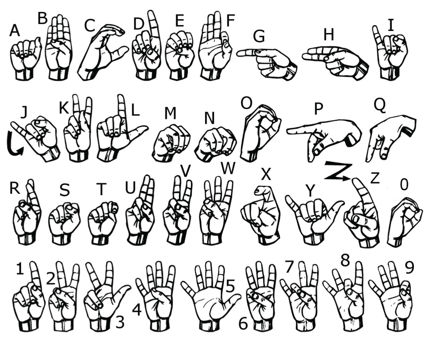

## Sign language detection project

#### Detect all letters of the alphabet except numbers.



#### To start, first enter this command in the terminal:

```pip install -r requirements.txt```

#### Next, run the [inference_classifier.py](inference_classifier.py) file.
